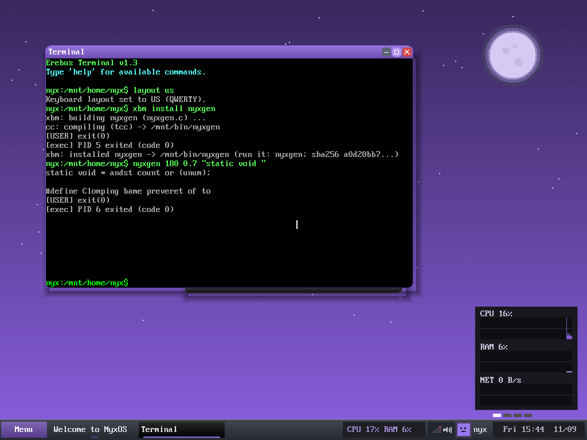
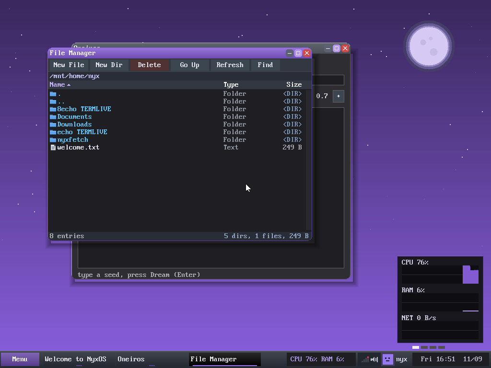
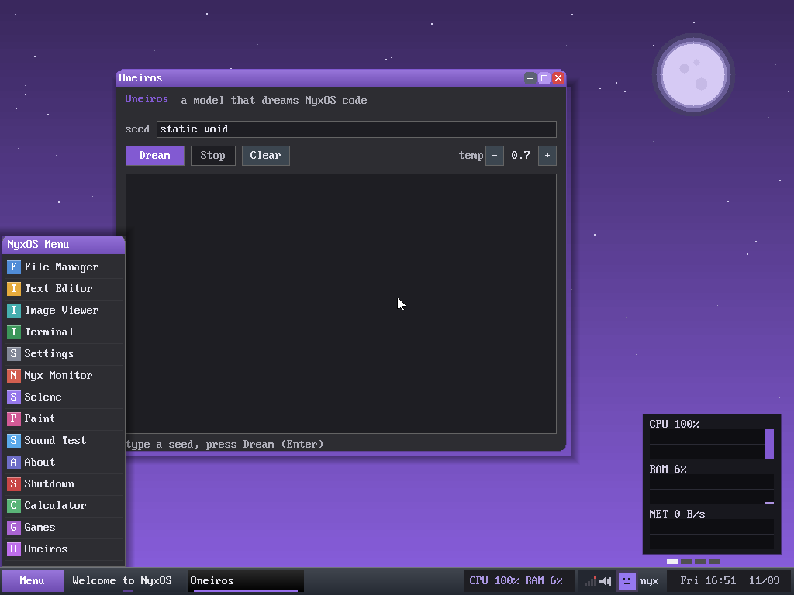

# Oneiros

A generative neural network for NyxOS, **written from scratch in C** — no ML
frameworks, no external libraries, no wrapping a hosted API. Its own embeddings,
its own tokenizer, its own transformer, its own backprop, even its own `expf`.
It is trained on NyxOS's own source code and it runs **inside NyxOS**.

Named for [Oneiros](https://en.wikipedia.org/wiki/Oneiroi), a child of Nyx — a
model that dreams NyxOS code.

## Honest scope

Oneiros is a **tech demo of a real from-scratch model**, not a coding tool. It
learns the *shape* of NyxOS's C — identifiers, control flow, the `nyx_*` idioms —
and generates code in that style:

```c
static int nyx_u8 d2 = (st - 1) - 2 * 3;
if ((k == 2)) { st[i]; nyx_i64 r = np;
    if (ck(st, 40)) {
```

It does **not** write code that compiles. That is a limit of scale (a small model,
a few million tokens, trained on a CPU), not a bug. What's interesting here is that
every neuron is home-grown and the whole thing runs in the OS it was trained on.

## What's in the box

The model was grown one honest, measured step at a time. Held-out loss, in
bits-per-byte (lower is better), on NyxOS code it never saw during training:

| step | model | bits/byte |
|------|-------|-----------|
| char-level MLP        | Bengio-style neural LM        | 2.84 |
| + BPE tokenizer       | reason in tokens, not bytes   | 2.54 |
| + bigger vocab + data |                               | 2.14 |
| transformer           | multi-head attn + FFN + residual | 2.01 |
| + RMSNorm             | LLaMA-style pre-norm          | 1.90 |
| + longer context (B=32) | **the champion**            | **1.78** |

Every network's hand-written backprop is checked against numerical gradients
(`<binary> gradcheck`) before it is trusted.

## Layout

    src/oneiros.c      char/token MLP (the seed)
    src/bpe.c          byte-pair-encoding tokenizer (learn / encode / decode)
    src/xformer.c      transformer block (multi-head attention + FFN + residual)
    src/xformer_ln.c   the champion: transformer + RMSNorm
    src/ngen_xln.c     self-contained inference for running INSIDE NyxOS
    src/nyxgen.c       the compact in-OS model as the `nyxgen` CLI (NyxOS port)
    nyxos/oneiros_win.c  the same model as a NyxOS desktop app (runs in the kernel GUI)
    model/             the trained champion + its vocabulary
    data/make_corpus.sh  builds the training corpus from a NyxOS checkout
    train.sh           reproduce a champion from scratch
    ROADMAP.md         the full iteration log; INTEGRATION.md the in-OS wiring

## Build & run (host)

```sh
gcc -O2 -march=native -DV=2048 -DB=32 -o xformer_ln src/xformer_ln.c -lm
./xformer_ln sample model/xformer_ln32.bin model/vocab2048.bin 80 0.7 "static void "
```

To train your own from a NyxOS checkout beside this one:

```sh
bash train.sh            # regenerates the corpus, learns the vocab, trains
```

## Running inside NyxOS

Oneiros ships in NyxOS as the **`nyxgen`** command (`src/nyxgen.c`, the
`user/pkg/nyxgen` port). You install it with NyxOS's own package manager, which
compiles the port **in-OS** with the NyxOS `cc` (TinyCC) — no cross-toolchain, no host:

```
xbm install nyxgen                # compiles nyxgen.c in-OS -> /mnt/bin/nyxgen
nyxgen 180 0.7 "static void "     # dream some NyxOS-style C
```



NyxOS userland provides `malloc`/`fopen`/`fread` and float math, but **not**
`exp`/`log`/`tanh` (and the kernel is `-mno-sse`), so Oneiros brings its own — the
in-OS build links with **no `-lm`**, and its output matches the libm build under
greedy decoding. One source compiles both ways: under the in-OS TinyCC it pulls
NyxOS's `libc.h` and spells its own fixed-width types (the OS ships no `<stdint.h>`)
and seeds from the RTC; under host `gcc` it uses the standard library.

The in-OS model is a compact char-level model (~150 KB, ~2.8 bits/byte) that fits
the OS image; `src/ngen_xln.c` runs the full 2.9 MB token champion (host, or in-OS
if you ship the bigger model). See `INTEGRATION.md`. The port landed in NyxOS in
[nyxos-dev/nyx-os#104](https://github.com/nyxos-dev/nyx-os/pull/104).

```sh
gcc -O2 -DV=2048 -DB=32 -o ngen_xln src/ngen_xln.c   # champion, host; no -lm
gcc -O2 -o nyxgen src/nyxgen.c                        # compact in-OS model; no -lm
```

### …and a desktop app

Oneiros is also a first-class NyxOS **desktop app** — the same model, in a window.
Open **Oneiros** from the Start menu, type a seed, press **Dream**, and it streams
NyxOS-style C live in the compositor (temperature slider and all). It runs right in
the kernel's GUI: every forward-pass buffer is heap-allocated (the kernel task stack
is only 4 KB), and the math is inline so no `float` ever crosses a call boundary (the
kernel is `-mno-sse`). Source is `nyxos/oneiros_win.c`; it lands in NyxOS via
[nyxos-dev/nyx-os#106](https://github.com/nyxos-dev/nyx-os/pull/106).





## License

GPL-2.0-or-later, matching NyxOS. See `LICENSE`.
